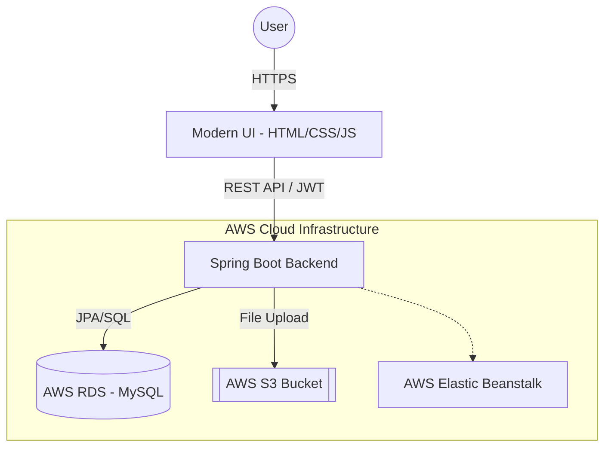

# 🎯 Expense Tracker: A Cloud-Powered Financial Management Solution

[](https://spring.io/projects/spring-boot)
[](https://aws.amazon.com/)
[](https://www.oracle.com/java/)
[](https://opensource.org/licenses/MIT)

**Expense Tracker** is a high-performance, full-stack web application designed to bring intelligence and efficiency to personal finance management. Built with a robust **Spring Boot** backend and a sleek, modern frontend, the system leverages **AWS Cloud Services** for enterprise-grade scalability, security, and reliability.

---

## 🏗️ Architecture Overview

The application follows a modern microservices-inspired architecture, deployed and scaled on the cloud:



---

## ✨ Key Features

-   **✅ Effortless Tracking:** Record, categorize, and analyze expenses and income with a few clicks.
-   **📈 Real-time Insights:** Interactive dashboards featuring **Chart.js** for visual expense distribution and historical trends (6-month overview).
-   **☁️ Cloud-Based Bill Storage:** Securely upload and retrieve receipts/bills, powered by **AWS S3** for persistent storage and audit trails.
-   **🎯 Smart Budgeting:** Set monthly budget limits and track spending progress with visual alerts.
-   **🔁 Recurring Subscriptions:** Track and manage monthly subscriptions and recurring bills automatically.
-   **🔐 Secure Authentication:** Robust user security implemented via **Spring Security** and **JWT (JSON Web Tokens)**.
-   **🌓 Dynamic UI:** Premium glassmorphism design with support for **Dark/Light mode** and responsive layouts.
-   **📊 Data Portability:** Export your transaction history to **CSV** for offline analysis.

---

## 🛠️ Tech Stack

### Backend
-   **Language:** Java 17
-   **Framework:** Spring Boot 3.2.0
-   **Security:** Spring Security, JWT
-   **Data Access:** Spring Data JPA (Hibernate)

### Frontend
-   **Core:** HTML5, CSS3 (Vanilla with Glassmorphism)
-   **Logic:** JavaScript (ES6+)
-   **Charts:** Chart.js
-   **Typography:** Outfit (Google Fonts)

### Cloud & Database
-   **Hosting:** AWS Elastic Beanstalk (Auto-scaling & Load Balancing)
-   **Database:** AWS RDS (MySQL)
-   **Storage:** AWS S3 (Secure Document/Bill Storage)

---

## 🚀 Getting Started

### Prerequisites
-   **Java 17** or higher
-   **Maven 3.x**
-   **MySQL 8.x** (or an AWS RDS instance)
-   **AWS Account** (for cloud features)

### Local Setup
1.  **Clone the Repository:**
    ```bash
    git clone https://github.com/GARJE-01/Expense-Tracker-cloud-computing.git
    cd Expense-Tracker-cloud-computing
    ```

2.  **Configure Database:**
    Update `src/main/resources/application.properties` with your database credentials:
    ```properties
    spring.datasource.url=jdbc:mysql://localhost:3306/expense_db
    spring.datasource.username=your_username
    spring.datasource.password=your_password
    ```

3.  **Build and Run:**
    ```bash
    mvn clean install
    mvn spring-boot:run
    ```
    Access the app at `http://localhost:8081`.


## 📜 License

This project is licensed under the MIT License - see the [LICENSE](LICENSE) file for details.

---
*Developed as part of our Cloud Computing expertise showcase.*
